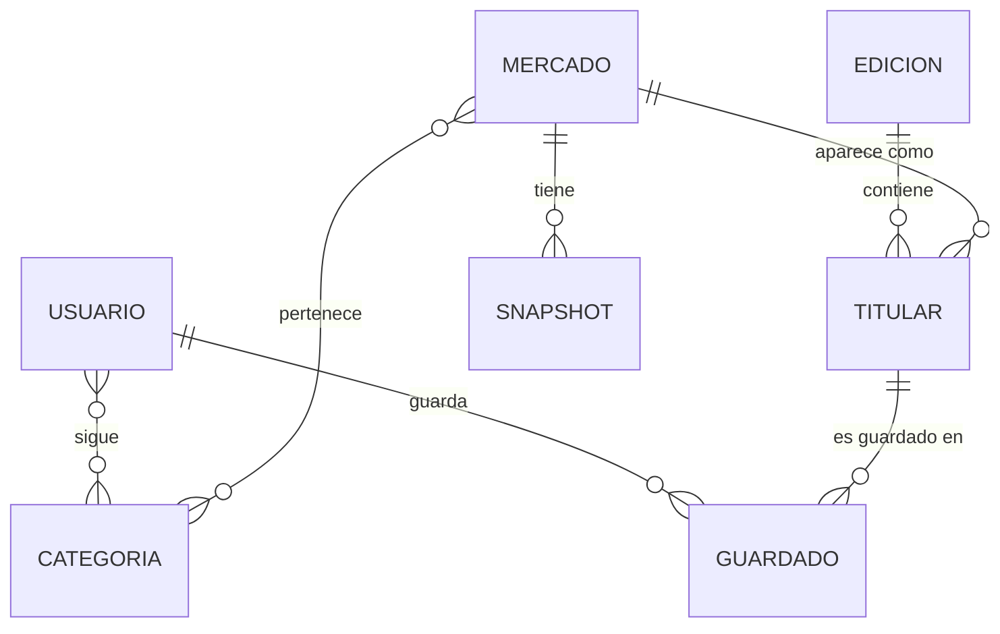

# I Don't Know: un diario donde cada noticia es una probabilidad

Backend del proyecto del curso CS 2031 Desarrollo Basado en Plataforma (UTEC, 2026-2).

Integrantes:

- Hideki Aldo Kunigami Chia
- Sergio Peña Andia
- Rance Blondet Borja
- Felipe Dipas Prado
- Joseph Geraldo Soto

Deploy: [PEGAR AQUÍ EL LINK DE RAILWAY]/api/v1 · Swagger: [LINK]/api/v1/swagger-ui/index.html

## Índice

1. [Introducción](#introducción)
2. [Identificación del problema](#identificación-del-problema)
3. [Descripción de la solución](#descripción-de-la-solución)
4. [Modelo de entidades](#modelo-de-entidades)
5. [Manejo de errores](#manejo-de-errores)
6. [Medidas de seguridad](#medidas-de-seguridad)
7. [Eventos y asincronía](#eventos-y-asincronía)
8. [Endpoints](#endpoints)
9. [Cómo correrlo](#cómo-correrlo)
10. [GitHub y gestión del proyecto](#github-y-gestión-del-proyecto)
11. [Conclusión](#conclusión)
12. [Apéndices](#apéndices)

## Introducción

### Contexto

Polymarket es una plataforma donde miles de personas apuestan dinero sobre cosas que van a pasar: elecciones, guerras, decisiones de la Fed, finales deportivas. El precio de cada apuesta funciona como una probabilidad: si el "Sí" cuesta 0.34, el mercado cree que hay 34% de que pase. Es información muy útil, pero está en inglés, pensada para apostar y no para informarse.

### Objetivos del proyecto

- Traer todos los días los mercados activos de Polymarket y guardar una foto diaria de su probabilidad.
- Armar automáticamente una portada con los temas que más cambiaron desde ayer, usando un puntaje propio.
- Convertir las preguntas en titulares en español con un modelo de lenguaje (Groq).
- Permitir que un usuario cree su cuenta, guarde titulares y siga temas para recibir alertas por correo.
- Construir todo con una arquitectura en capas, segura con JWT y con procesos lentos en segundo plano.

## Identificación del problema

### Descripción del problema

Alguien que quiere saber cómo va una elección no va a leer cientos de mercados en inglés en una página de apuestas. Y aunque lo haga, Polymarket solo muestra el precio actual: no hay forma directa de ver cuánto cambió la opinión de un día a otro, que es lo que convierte un tema en noticia.

### Justificación

Los medios cuentan lo que pasó, pero los mercados de predicción muestran lo que la gente cree que va a pasar, y con dinero de por medio. Llevar esa información al español, ordenada como un diario y con historial, la hace útil para cualquier lector. Además, el cambio diario es un buen filtro editorial: si un mercado se movió 15 puntos en un día, algo pasó.

## Descripción de la solución

### Funcionalidades implementadas

1. Registro e inicio de sesión con JWT. Al registrarse, el usuario recibe un correo de bienvenida.
2. Sincronización diaria con Polymarket. Un job programado (todos los días a las 6 a.m.) trae los mercados activos, crea los nuevos, les asigna una categoría según palabras clave de la pregunta y guarda un snapshot de la probabilidad del día.
3. Portada automática. Con los movimientos del día se calcula un puntaje por mercado: puntos por cada punto porcentual de cambio, +15 si cruzó el 50% y +10 si se define en menos de 7 días. Los 10 con mayor puntaje entran a la portada, y Groq convierte cada pregunta en un titular en español.
4. Archivo de portadas y detalle de cada titular con el historial de probabilidades, para el gráfico de "cómo cambió".
5. Búsqueda de mercados con paginación, filtro por categoría y búsqueda por texto.
6. Titulares guardados por usuario.
7. Seguir categorías. Si un mercado de una categoría que sigues cruza el 50%, te llega un correo.
8. Gestión de categorías, solo para el rol ADMIN.

### Tecnologías utilizadas

- Java 21 y Spring Boot 4.1 (Web MVC, Data JPA, Security, Validation, Mail, Thymeleaf)
- PostgreSQL 16
- JJWT 0.12 para los tokens y BCrypt para las contraseñas
- ModelMapper para el mapeo entidad-DTO y Lombok
- Springdoc OpenAPI (Swagger UI)
- APIs externas: Polymarket Gamma API (mercados y precios) y Groq con el modelo `llama-3.3-70b-versatile` (titulares en español)
- Docker y Docker Compose para desarrollo local, Railway para el deploy
- JUnit 5 y Mockito para las pruebas, GitHub Actions para CI

## Modelo de entidades



### Descripción de entidades

- Usuario: nombre, email (único), contraseña hasheada con BCrypt, rol (`USER` o `ADMIN`) y fecha de registro. Sigue varias categorías (ManyToMany) y tiene varios guardados (OneToMany).
- Categoria: nombre único (POLITICA, ECONOMIA, DEPORTES, TECNOLOGIA). Se relaciona muchos a muchos con Mercado y con Usuario.
- Mercado: id de Polymarket (único e indexado), pregunta original en inglés, probabilidad actual, si está resuelto y fecha estimada de resolución. Tiene muchos snapshots y pertenece a varias categorías.
- Snapshot: la foto diaria de un mercado (probabilidad y fecha). Hay una restricción única por mercado y fecha, así que solo existe una foto por día.
- Edicion: la portada de un día. La fecha es única.
- Titular: pertenece a una edición y a un mercado. Guarda el texto en español, la probabilidad del día, el cambio desde ayer y el puntaje.
- Guardado: tabla intermedia entre Usuario y Titular con la fecha en que se guardó. Tiene una restricción única (usuario, titular) para no guardar dos veces lo mismo.

Todas las relaciones usan `FetchType.LAZY`. Las colecciones que dependen de su padre (snapshots de un mercado, titulares de una edición, guardados de un usuario) usan `cascade = ALL` y `orphanRemoval`. En las entidades hay restricciones de base de datos (`nullable`, `unique`, `length`, índices) y validaciones como `@NotBlank`, `@Email`, `@Size`, `@DecimalMin` y `@DecimalMax`. Los DTOs de entrada se validan con `@Valid`, y la contraseña además con un `@Pattern` que exige mayúscula, minúscula y número.

Los controladores nunca devuelven entidades: hay DTOs separados de request, response, detalle y resumen (por ejemplo `MercadoResponseDTO` y `MercadoDetailDTO`, o `EdicionResponseDTO` y `EdicionSummaryDTO`), y ninguno expone la contraseña.

## Manejo de errores

Todos los errores pasan por un `@RestControllerAdvice` (`GlobalExceptionHandler`) que responde siempre con el mismo formato:

```json
{
  "timestamp": "2026-09-23T21:39:46.621",
  "status": 409,
  "error": "Conflict",
  "message": "Ya existe una cuenta con ese email",
  "path": "/api/v1/auth/register"
}
```

Excepciones propias y su código:

| Excepción | HTTP | Cuándo |
|---|---|---|
| `ResourceNotFoundException` | 404 | No existe el mercado, titular, categoría o portada |
| `DuplicateResourceException` | 409 | Email ya registrado, categoría repetida, titular ya guardado |
| `InvalidCredentialsException` | 401 | Email o contraseña incorrectos |
| `InvalidOperationException` | 400 | Dejar de seguir una categoría que no sigues |
| `ExternalServiceException` | 500 | Falla al consultar Polymarket |
| `EmailSendingException` | 500 | Falla del servidor de correo |

`TokenExpiredException` (401) y `UnauthorizedOperationException` (403) también están definidas; las dejamos listas para cuando agreguemos refresh tokens y permisos por recurso.

También se manejan excepciones de Spring: `MethodArgumentNotValidException` (400, con el campo y el mensaje), `HttpMessageNotReadableException` (400, JSON mal formado), `AccessDeniedException` (403) y un caso genérico que devuelve 500 sin exponer detalles internos. Tenerlo en un solo lugar evita try/catch en los controladores y el frontend siempre recibe el mismo formato.

## Medidas de seguridad

### Seguridad de datos

- Autenticación stateless con JWT. El login y el registro devuelven un token firmado con HMAC que dura 24 horas. `JwtFilter` lo lee del header `Authorization: Bearer`, valida la firma y la expiración, carga al usuario con un `UserDetailsService` propio y lo pone en el `SecurityContext`.
- Los servicios obtienen al usuario autenticado desde el `SecurityContext`. Por eso un usuario solo puede ver y editar su propio perfil y sus propios guardados, sin mandar su id en la URL.
- Roles guardados en la base de datos (`USER` y `ADMIN`). Las reglas por ruta están en `SecurityConfig`, y además los métodos sensibles (crear y borrar categorías) tienen `@PreAuthorize("hasRole('ADMIN')")`.
- Leer la portada, titulares, mercados y categorías es público; guardar, seguir temas y ver el perfil requieren token.
- Contraseñas hasheadas con BCrypt. La clave del JWT, las credenciales de la base de datos, la API key de Groq y la contraseña del correo se leen de variables de entorno y el `.env` no se sube al repositorio.

### Prevención de vulnerabilidades

- Inyección SQL: todo el acceso a datos es con Spring Data JPA y consultas JPQL con parámetros (`:categoria`, `:q`). Nunca se concatena texto del usuario en una consulta.
- CSRF: está deshabilitado porque la API es stateless y no usa cookies de sesión. El token viaja en un header, que un sitio externo no puede agregar solo.
- CORS: solo se aceptan los orígenes configurados en `CORS_ALLOWED_ORIGINS` (por defecto los puertos locales del frontend).
- XSS: la API solo devuelve JSON y en los correos Thymeleaf escapa las variables.

## Eventos y asincronía

Usamos eventos de Spring para que la lógica principal no dependa del envío de correos ni de otras tareas secundarias:

1. `UsuarioRegistradoEvent`: lo publica `AuthService` al registrar a alguien. `EmailService` lo escucha y manda el correo de bienvenida.
2. `MercadoUmbralCruzadoEvent`: lo publica `MercadoService` cuando un mercado pasa de menos de 50% a 50% o más. El listener usa `@TransactionalEventListener` (después del commit), busca a los usuarios que siguen alguna categoría de ese mercado y les manda la alerta.
3. `PortadaGeneradaEvent`: lo publica `PortadaBuilderService` cuando termina de armar la portada del día y queda registrado en el log.

Los listeners son `@Async` y corren en un `ThreadPoolTaskExecutor` propio (`AsyncConfig`, de 4 a 8 hilos). Tienen que ser asíncronos porque mandar un correo por SMTP puede tardar varios segundos, y la alerta de umbral puede ir a muchos usuarios a la vez. Si fuera síncrono, el registro tardaría lo que tarda Gmail en responder, y la sincronización quedaría bloqueada mientras salen los correos. Los correos usan plantillas HTML con Thymeleaf (`welcome-email.html` y `umbral-cruzado-email.html`). Si un envío falla se registra en el log y no se corta el resto.

La sincronización con Polymarket también corre en segundo plano con `@Scheduled` y `@Async`. Cada mercado se procesa en su propia transacción, así que si uno falla los demás igual se guardan. Si Groq no responde, el titular queda con la pregunta original y la portada se arma igual.

## Endpoints

Base: `/api/v1`. La colección `postman_collection.json` tiene todos los endpoints con descripción, variables, autenticación Bearer configurada y ejemplos de respuesta exitosa y de error.

| Método | Ruta | Acceso | Descripción |
|---|---|---|---|
| POST | `/auth/register` | Público | Crear cuenta |
| POST | `/auth/login` | Público | Iniciar sesión |
| GET | `/usuarios/me` | Usuario | Ver mi perfil |
| PUT | `/usuarios/me` | Usuario | Actualizar nombre o contraseña |
| POST | `/usuarios/me/categorias/{id}` | Usuario | Seguir una categoría |
| DELETE | `/usuarios/me/categorias/{id}` | Usuario | Dejar de seguirla |
| GET | `/categorias` | Público | Listar categorías |
| POST | `/categorias` | ADMIN | Crear categoría |
| DELETE | `/categorias/{id}` | ADMIN | Borrar categoría |
| GET | `/mercados?categoria=&q=&page=&size=` | Público | Buscar mercados (paginado) |
| GET | `/mercados/{id}` | Público | Detalle con historial |
| GET | `/ediciones/hoy` | Público | Portada de hoy |
| GET | `/ediciones/{fecha}` | Público | Portada de una fecha |
| GET | `/ediciones?page=&size=` | Público | Archivo de portadas |
| GET | `/titulares/{id}` | Público | Detalle de un titular |
| POST | `/guardados` | Usuario | Guardar un titular |
| DELETE | `/guardados/{titularId}` | Usuario | Quitarlo de guardados |
| GET | `/guardados` | Usuario | Mis titulares guardados |

## Cómo correrlo

Requisitos: Docker. Para correrlo desde el IDE, además Java 21.

```bash
cp .env.example .env      # completar con las claves reales
docker compose up --build
```

La API queda en `http://localhost:8080/api/v1` y Swagger en `http://localhost:8080/api/v1/swagger-ui/index.html`. El `data.sql` crea las cuatro categorías y un usuario administrador (`admin@idontknow.com` / `admin123`) para probar.

Variables de entorno:

| Variable | Para qué |
|---|---|
| `DB_URL`, `DB_USERNAME`, `DB_PASSWORD` | Conexión a PostgreSQL |
| `JWT_SECRET` | Clave para firmar los tokens (64+ caracteres) |
| `GROQ_API_KEY` | Traducción de titulares |
| `MAIL_USERNAME`, `MAIL_APP_PASSWORD` | Cuenta de Gmail que envía los correos |
| `CORS_ALLOWED_ORIGINS` | Orígenes permitidos para el frontend |

## GitHub y gestión del proyecto

[COMPLETAR con lo que realmente hicieron: si usaron GitHub Projects, cómo repartieron los issues, qué labels y milestones usaron, y la regla de ramas. Por ejemplo: "Usamos un tablero de GitHub Projects con columnas To do / In progress / Done. Cada funcionalidad fue un issue con su responsable y fecha límite, y trabajamos con ramas feature/* que se integraban a develop por pull request con revisión de otro integrante."]

GitHub Actions: el workflow `.github/workflows/ci.yml` corre en cada push y pull request a `main` y `develop`. Levanta un contenedor de PostgreSQL, configura Java 21 y ejecuta `./mvnw clean verify`, que compila el proyecto y corre las pruebas unitarias de `AuthService`, `CategoriaService`, `MercadoService`, `GuardadoService` y `ScoreCalculator`, además del test que levanta el contexto completo. Si algo falla, el PR queda marcado y no se integra.

Deploy: el backend está en Railway, conectado al repositorio y construido con el `Dockerfile`, con una base PostgreSQL del mismo proyecto y todas las credenciales como variables de entorno del servicio.

## Conclusión

### Logros del proyecto

Tenemos un backend que se actualiza solo: cada mañana trae los mercados, guarda la foto del día, calcula qué cambió y arma una portada en español sin que nadie haga nada. Sobre eso, un usuario puede crear su cuenta, guardar titulares, seguir temas y recibir alertas cuando algo importante cambia.

### Aprendizajes clave

- Lo más difícil fue lo que anticipamos en la propuesta: que la portada se arme sola. Tuvimos que entender cómo funcionan `@Scheduled` y `@Async`, y por qué un evento asíncrono no puede recibir una entidad con relaciones LAZY (el hilo nuevo ya no tiene la sesión de Hibernate).
- Guardar el historial fue lo que hizo posible todo lo demás. Sin los snapshots no hay "cambio desde ayer" ni puntaje.
- Integrar APIs externas obliga a pensar qué pasa cuando fallan. Por eso Groq tiene un fallback y cada mercado se sincroniza en su propia transacción.

### Trabajo futuro

- Portada personalizada según los temas que sigue cada usuario, y filtro de la portada por categoría.
- Explicación corta de cada mercado generada con Groq, y volumen del mercado en el detalle.
- Refresh tokens y recuperación de contraseña por correo.
- Clasificar las categorías con el modelo de lenguaje en vez de palabras clave.
- El frontend en React, que es la siguiente entrega.

## Apéndices

### Licencia

MIT. Ver el archivo `LICENSE`.

### Referencias

- Documentación de Spring Boot y Spring Security: https://docs.spring.io/spring-boot/
- Polymarket Gamma API: https://docs.polymarket.com/
- Groq API: https://console.groq.com/docs
- JJWT: https://github.com/jwtk/jjwt
- Material de laboratorio del curso CS 2031 (UTEC, 2026-2)
